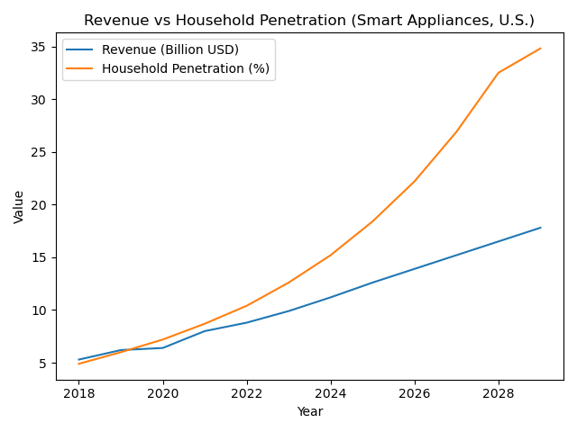

# Strategic Planning & Insights Project (Smart Appliances, U.S.)

This project builds a **strategy planning + KPI tracking** workflow by combining multi-dimensional business metrics into a unified dataset and generating **executive-ready insights**:
- Track **progress vs. goals** (Revenue, Growth, Penetration)
- Identify **operational/customer pressure points** via trend + root-cause style analysis
- Produce dashboards/figures suitable for management updates

## Dataset
This project expects the Statista Market Insights export you provided:
- `data/raw/mi_consumer_smart-home_united-states_usd_en_with_kmis_*.csv`

## Visual Analysis

### Revenue vs Household Penetration

Revenue continues to increase alongside rapid household penetration gains,
while growth rates gradually decelerate—indicating a transition toward a more
mature adoption phase with increasing planning complexity.

**Planning implication:** Near-term growth remains penetration-driven, but
mid-term strategy should increasingly focus on value expansion and efficiency.

